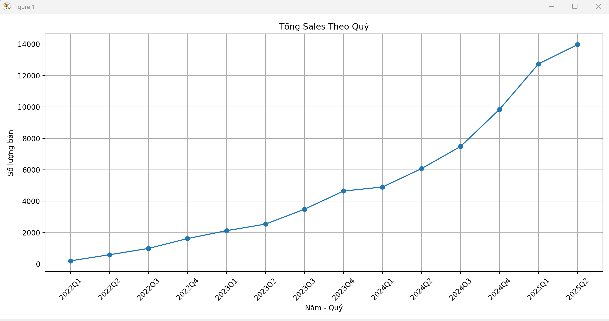
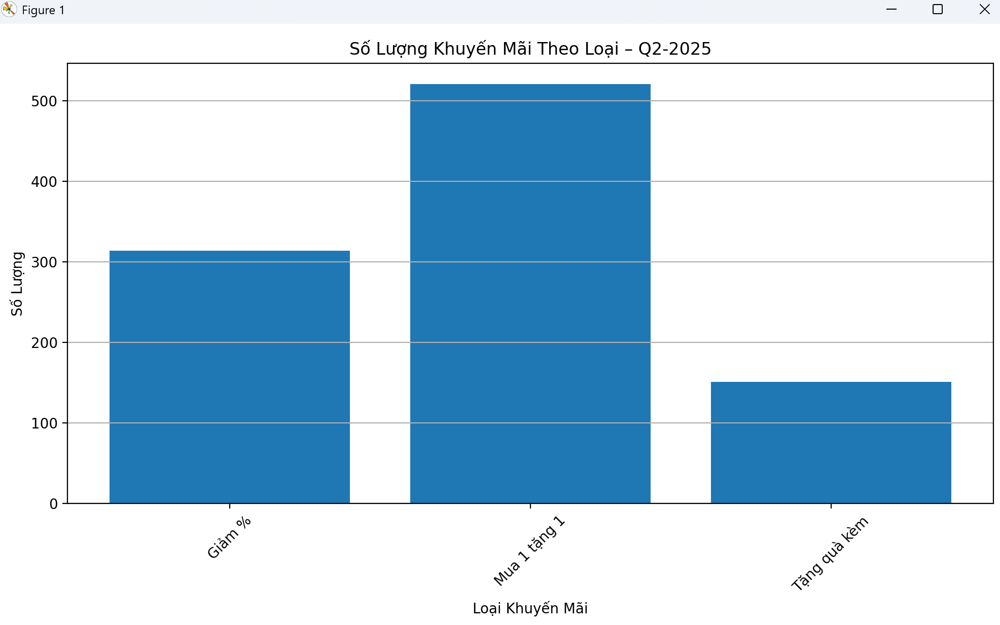
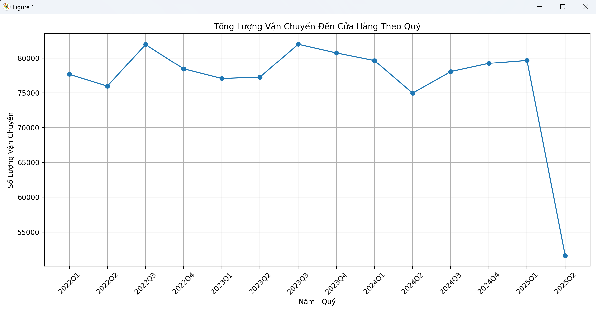

# Analysis Log – Tỷ lệ sử dụng kho Q2-2025 giảm

**Dự án:** Tối ưu kho vận  
**Người thực hiện:** Lê Tuấn 
**Ngày:** 2025-06-24  
**Dashboard phát hiện vấn đề:** `Warehouses monitor`

---

## 1. Vấn đề phát hiện từ dashboard

- **warehouse utilization** giảm mạnh bất thường tại **Q2-2025** (từ ~2.29% → chỉ còn 2.1%)
- Câu hỏi chính:  
  > "Sự sụt giảm này là do yếu tố tạm thời hay có vấn đề vận hành nghiêm trọng?"

---

## 2. Mục tiêu phân tích

- Kiểm tra chuỗi nguyên nhân có thể ảnh hưởng đến tồn kho hoặc sức chứa kho.
- Xác định xem có yếu tố đặc biệt nào gây ảnh hưởng đến **utilization** tại Q2-2025.

---

##  3. Các bước phân tích & lý do

| Bước | Nội dung phân tích | Lý do |
|------|---------------------|-------|
| 1 | Kiểm tra lịch sử nhập hàng theo quý | Để xem Q2-2025 có ít shipment hơn không |
| 2 | Kiểm tra lịch sử bán hàng theo quý | Để xác định có bán đột biến không |
| 3 | Kiểm tra lịch khuyến mãi | Có chiến dịch đẩy hàng mạnh gây giảm tồn kho không |
| 4 | Kiểm tra lượng hàng chuyển đến store | Có phải hàng đã được điều chuyển sang cửa hàng |

---

## 4. Kết quả từng bước

### ✅ Bước 1 – Nhập hàng theo quý

```sql
SELECT 
    YEAR(shipment_date) AS year,
    QUARTER(shipment_date) AS quarter,
    SUM(quantity) AS total_shipment
FROM shipments
GROUP BY YEAR(shipment_date), QUARTER(shipment_date)
ORDER BY year, quarter;
```

#### Kết quả tổng hợp:

| Năm  | Q1     | Q2     | Q3     | Q4     |
|------|--------|--------|--------|--------|
| 2022 | 77,665 | 75,964 | 81,956 | 78,446 |
| 2023 | 77,056 | 77,263 | 81,999 | 80,750 |
| 2024 | 79,651 | 74,962 | 78,047 | 79,238 |
| 2025 | 79,673 | **51,602** |        |        |

#### Nhận định:

- **Quý 2/2025 chỉ nhập 51,602 đơn vị hàng**, thấp hơn rõ rệt so với các quý trước:
  - Q2/2024: 74,962 → giảm ~31%
  - Q1/2025: 79,673 → giảm ~35%

- **Sự sụt giảm nhập hàng là bất thường**, có khả năng là nguyên nhân chính gây nên:
  - Mức sử dụng kho (utilization rate) trong Q2-2025 giảm mạnh chỉ còn ~2.1%
  - Gây lãng phí tài nguyên kho, thiếu hàng cục bộ

---

### ✅ Bước 2 – Kiểm tra lịch sử xuất hàng (sales) theo quý
#### Biểu Đồ:


#### Nhận định:
- Doanh số bán hàng **tăng liên tục qua các quý**.
- **Q2-2025** tiếp tục là quý có **doanh số cao nhất**.
- **Không có dấu hiệu doanh số sụt giảm** → Nhu cầu thị trường đang **tăng mạnh**.

## 👉 Tạm kết luận qua 2 bước:
- Doanh số bán ra ở **Q2-2025 cao hơn các quý trước** → Việc giảm tồn kho là **hợp lý**.   
- Việc tồn kho giảm có thể **đúng theo quy luật cung – cầu thực tế**.  
- Nguyên nhân có thể xuất phát từ việc **bán quá tốt → không kịp bổ sung hàng hóa.**

---

### ✅ Bước 3 – Kiểm tra lịch khuyến mãi trong Q2-2025
#### Biểu Đồ:



#### Nhận xét: Q2-2025 có rất nhiều khuyến mãi
- **Mua 1 tặng 1:** hơn 500 chương trình → Loại khuyến mãi tác động rất mạnh đến hành vi mua hàng.
- **Giảm %:** hơn 300 chương trình → Khuyến khích mua sắm số lượng lớn.
- **Tặng quà kèm:** khoảng 150 chương trình → Tăng giá trị cảm nhận của khách hàng.

--> **Khối lượng khuyến mãi đặc biệt lớn trong Q2-2025 → Có thể tạo ra sức mua đột biến.**

## 👉 Kết Luận tổng hợp 3 bước:
✔️ Việc giảm mạnh tồn kho ở **Q2-2025** là hoàn toàn **hợp lý** khi có hoạt động khuyến mãi mạnh như vậy.  
✔️ Đây là **tác động từ chính sách marketing, không phải lỗi vận hành.**  
✔️ Doanh số tăng mạnh có thể là **kết quả trực tiếp từ các chương trình mua 1 tặng 1 và giảm giá.**

---

### ✅ Bước 4 – Kiểm tra lượng hàng xuất kho để chuyển đến store trong Q2-2025
#### Biểu Đồ:


#### Nhận xét:
- **Q2-2025 có lượng vận chuyển đến cửa hàng giảm đột ngột.**
- Các quý trước dao động quanh **75,000 – 82,000 đơn vị.**
- **Q2-2025 chỉ còn khoảng 52,000 đơn vị** → Giảm rất mạnh so với các kỳ trước.
- Trong khi đó, **doanh số Q2-2025 lại cao nhất.**
- **Doanh số tăng mạnh nhưng lượng vận chuyển lại giảm** → Đây là dấu hiệu **bất thường.**

---

## Kết Luận tổng hợp 4 bước:
- Đây **có khả năng là vấn đề vận hành hoặc lỗi dữ liệu.**

- Nếu bán ra nhiều nhưng lượng vận chuyển đến cửa hàng giảm → Có thể xảy ra một trong các trường hợp:
  - **Dữ liệu shipment bị ghi thiếu** → Có thể do lỗi nhập liệu hoặc thiếu cập nhật.
  - **Vận chuyển thực tế không kịp** → Gây mất hàng, thất thoát, hoặc stock-out tại cửa hàng.
  - **Cửa hàng bán ra từ hàng tồn trước** → Dẫn đến không cần bổ sung ngay → Nhưng **không bền vững cho kỳ sau.**


# 🚩 Kết Luận Cuối Cùng

Tồn kho giảm mạnh ở **Q2-2025 không phải là bất thường vận hành đơn thuần.**

Đây là hệ quả kết hợp giữa:
- Doanh số bán **tăng đột biến.**
- Chiến dịch khuyến mãi lớn **tạo áp lực rút hàng nhanh.**
- Nhưng năng lực vận chuyển **không đáp ứng kịp nhu cầu bổ sung** → Lượng shipment thấp.(có thể do dự đoán sai nhu cầu)

# ✨ Khuyến Nghị Hành Động

- Xem xét **nâng công suất vận chuyển trong các kỳ khuyến mãi lớn.**
- Tối ưu tuyến vận chuyển để đảm bảo **tốc độ bổ sung hàng về cửa hàng được duy trì theo nhịp bán.**
- Xây dựng **hệ thống cảnh báo stock-out sớm**
- Xây dựng **mô hình dự báo nhu cầu chính xác hơn, đặc biệt trong các kỳ khuyến mãi.**
- Phân tích trước **các chương trình marketing lớn** để chuẩn bị đủ hàng và năng lực vận chuyển tương ứng.
